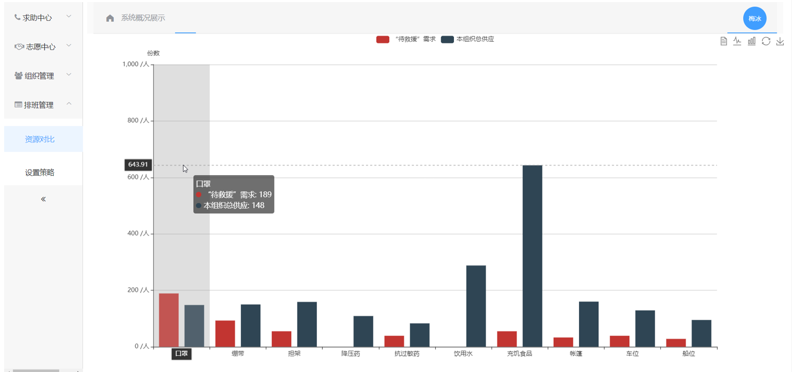
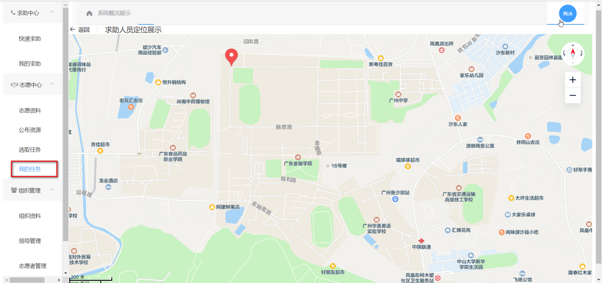
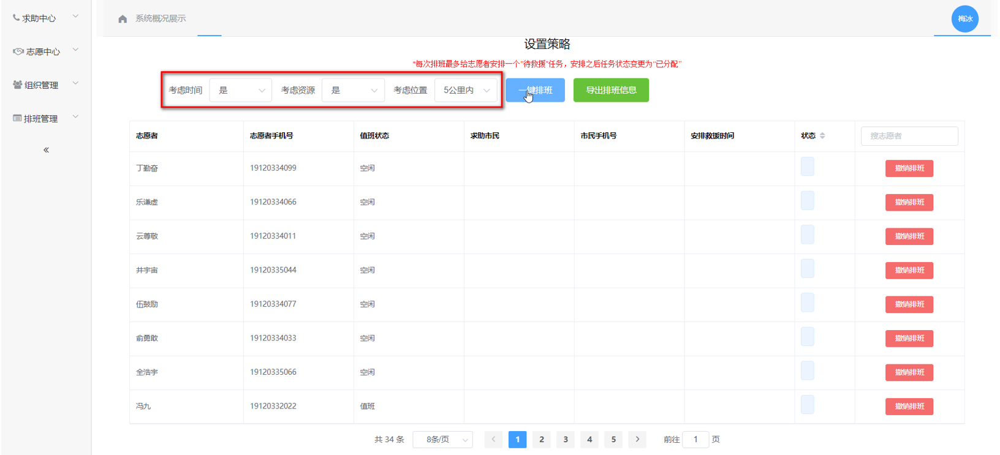
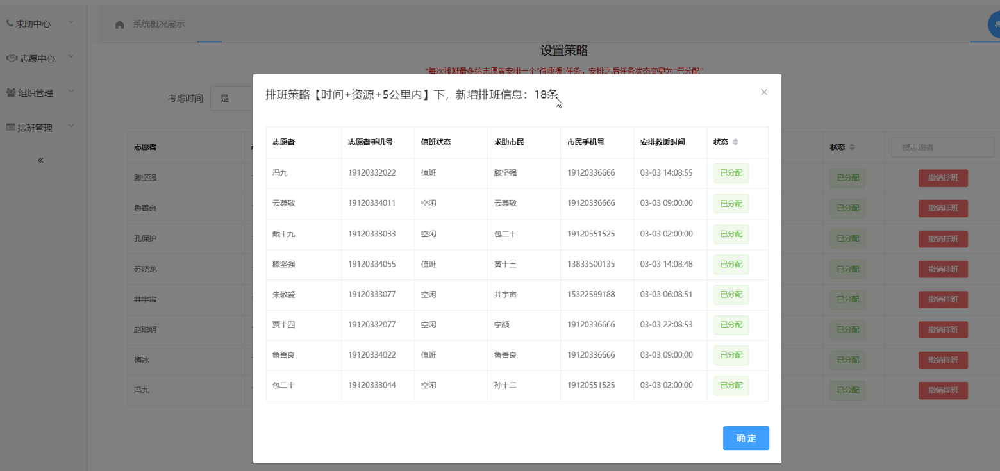
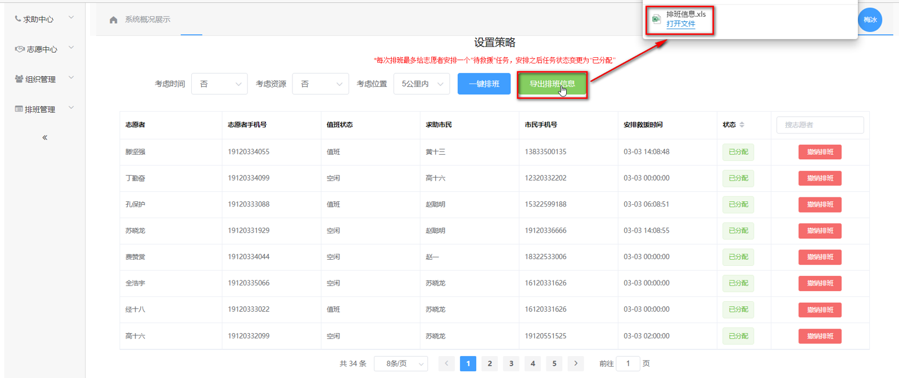
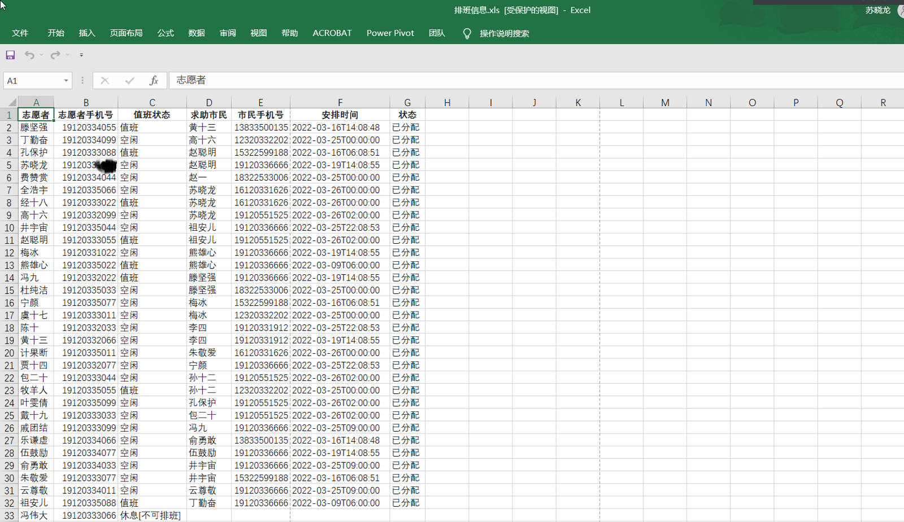

# ResourceCoordinationSystem

软件环境：SpringBoot+Mybatis+Mysql+Vue+Elementui+Echarts 实现情况：系统包含资源展示、腾讯地图定位选点、JWT登录校验、验证码、邮箱提醒模块，核心功能主要包含时间策略、资源策略、位置策略三种策略及其组合的排班；综合考虑紧迫状态进行自动化资源调度分配，以及预留手动优先分配功能。
主要亮点：结合Vue和ElementUI构建响应式前端页面，提升用户体验；利用Echarts实现数据可视化。

### 系统亮点展示

##### 1、资源展示

##### 2、地图选点

##### 3、排班

**步骤1：设置排班条件**

**步骤2：点击排班按钮，并得到排班概况**

**步骤3：系统展示所有排班情况，可以手动搜索进行二次调整**

**步骤4：后台会通过平台消息提示、邮件提示志愿者和市民，管理员可下载排班表**

### 系统功能亮点：

1. **志愿者排班管理：**
   - 系统通过模块化设计实现了志愿者的排班管理。志愿者可以自主选择任务，并标记任务状态（如“已分配”、“救援中”或“已完成”）。这种灵活的排班机制适用于突发事件中的应急调度，减少了资源调度与实际需求不匹配的情况。

2. **地图选点与定位功能：**
   - 系统集成了地图定位功能，允许用户精准选择地点，并在紧急求助或志愿任务中实时查看具体位置。相比单纯通过 GPS 定位，系统提供了手动标记位置的功能，极大提高了定位的精确度，便于志愿者快速响应。

3. **动态资源展示与对比：**
   - 通过折线图、柱状图、饼状图等多种数据可视化方式展示资源的分布情况。领导者能够实时查看志愿者持有的资源和系统中待救援的求助信息，从而制定更加合理的排班和调度策略。

4. **去中心化资源管理：**
   - 系统并不依赖于集中仓库，而是通过志愿者个人资源的公开与管理实现资源分配。志愿者公布的个人资源可被组织查询，形成去中心化的物资调配方式，这种机制在突发事件下能够提高调度效率，减少物资囤积成本。

5. **多角色支持：**
   - 系统支持多种角色，包括普通市民、志愿者和领导者。每个角色具有不同的权限和功能，市民可以发起求助，志愿者可以执行任务，领导者则可以管理组织和分配资源。

### 涉及的技术栈：

1. **后端：**
   - **SpringBoot**：用于构建后端应用，提供了内嵌的 Tomcat 服务器，并通过约定大于配置的方式减少了配置文件的复杂度。它简化了开发过程，使得部署更加高效。
   - **MySQL**：关系型数据库，负责存储用户信息、求助信息、排班策略等重要数据。
   - **MyBatis**：持久层框架，负责对象与数据库的映射操作，减少了直接编写 SQL 语句的复杂度，并与 Spring 框架集成。

2. **前端：**
   - **Vue.js**：前端框架，主要用于实现响应式数据绑定，简化了前端界面的开发。它提高了系统在前端数据处理上的灵活性。
   - **ElementUI**：基于 Vue 的组件库，用于构建用户界面的各种功能组件，比如表单、图表等。
   - **ECharts**：用于数据可视化，展示各类资源情况、任务进度等信息。

3. **其他技术：**
   - **Git**：版本控制工具，用于管理代码库和跟踪项目进度。
   - **Maven**：项目构建和依赖管理工具，简化了项目中依赖包的管理和迁移过程。

总结：这套系统通过**灵活的排班和调度机制**、**动态的资源展示**和**多重消息通知**，提升了高校在突发事件下应急救援的能力。
